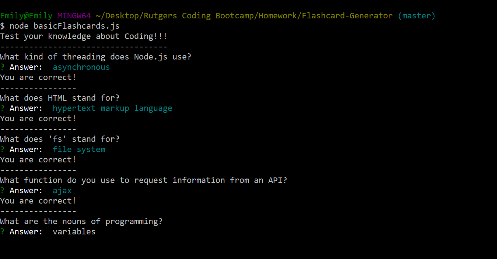
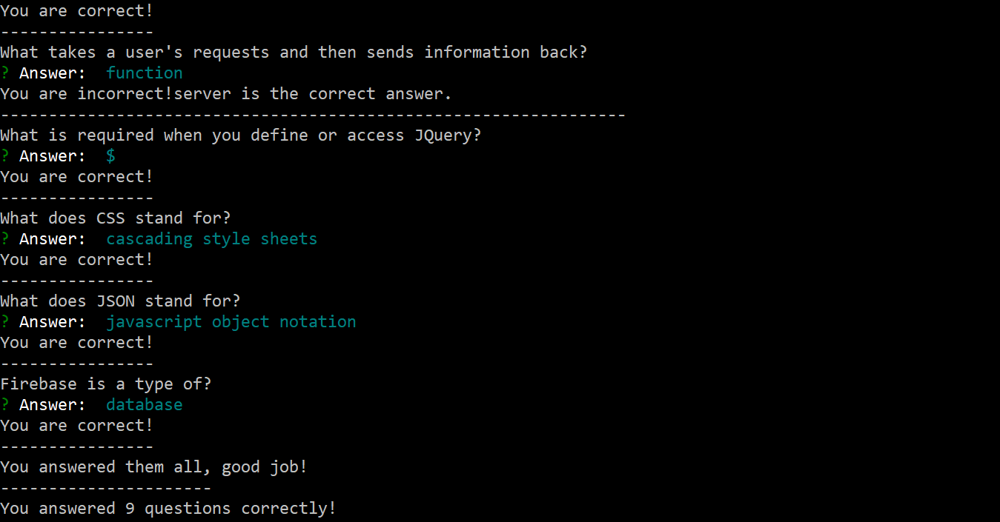
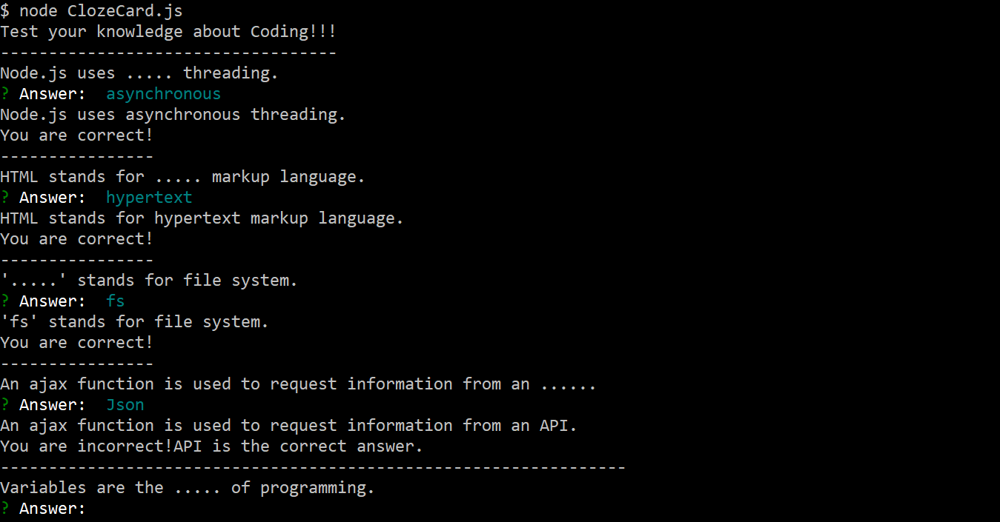
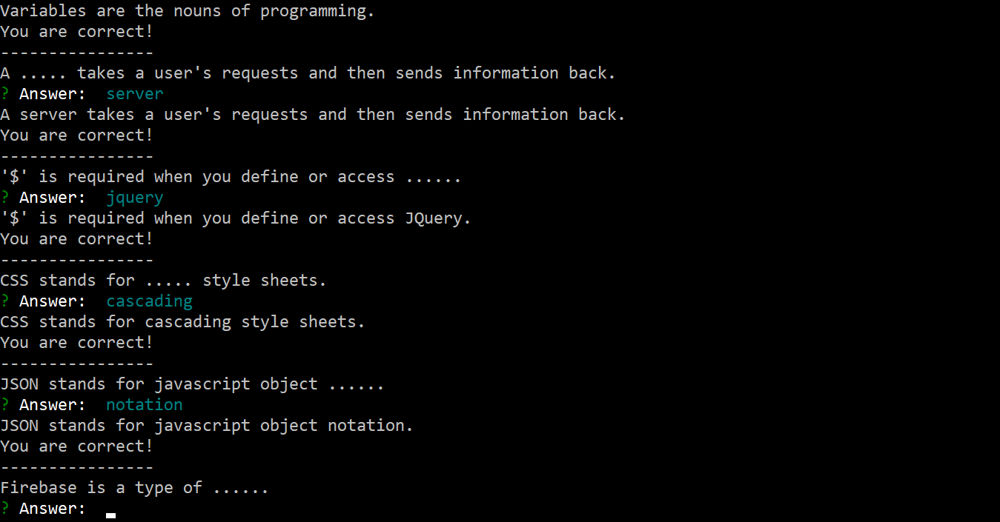
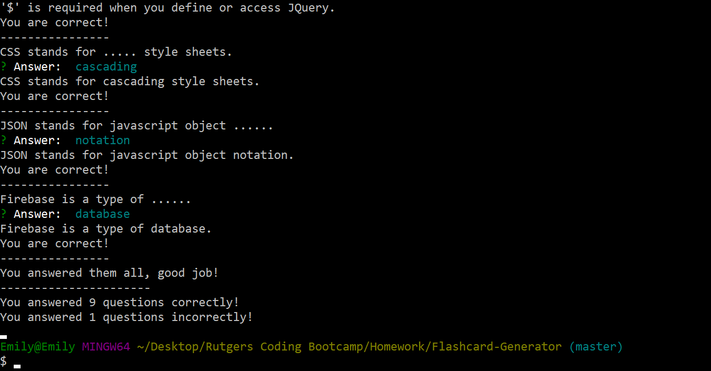

# Flashcard-Generator

This is a command line Node application that generates flashcards in two ways.

## Basic Flashcards

This version of the application prompts the user with a question and then the user has to type in their response. If they are correct, they are told they are correct. If they are incorrect, they are told they are wrong. 

At the end the user is told the number of questions they answered correctly and incorrectly.

## Cloze Cards

In this verison of the application the user is show a sentence with part of the sentence missing. The user must then enter in the missing part of the sentence. 

After they answer they are told if they answered the question correctly and at the end they are given a total of the number of correct and incorrect answers they had. 

## Languages and Packages Used

This application uses Node.JS.

The npm package used is inquirer. 
